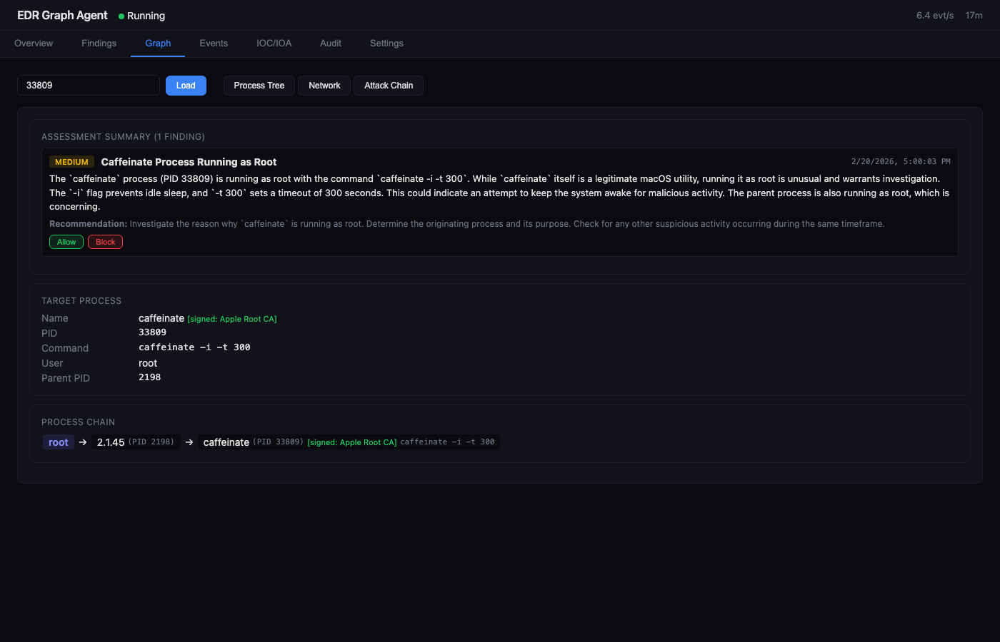
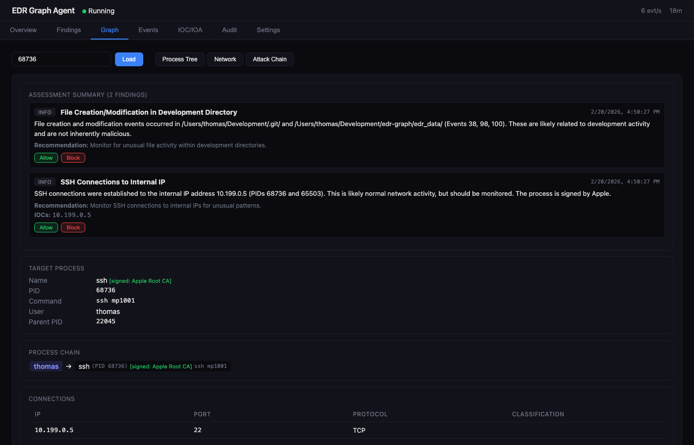
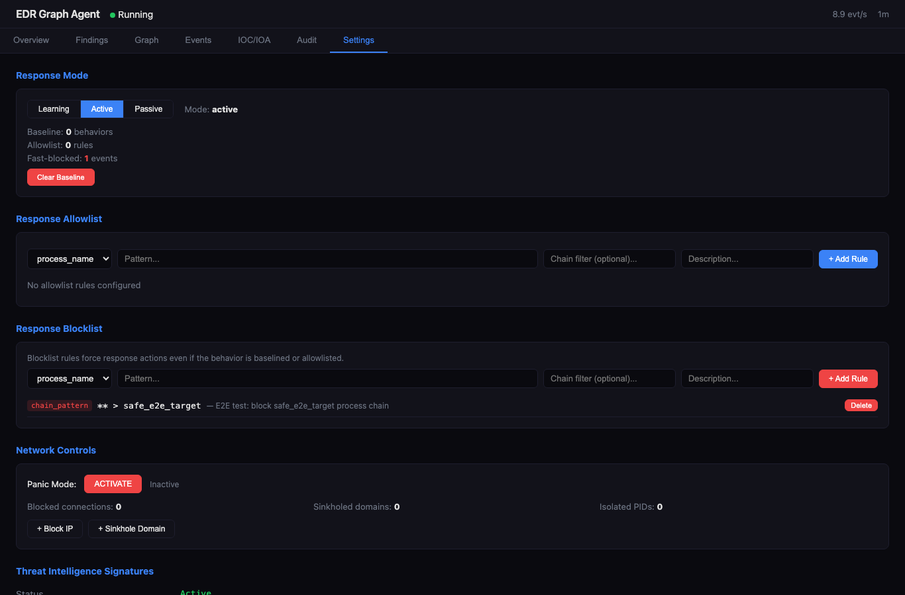
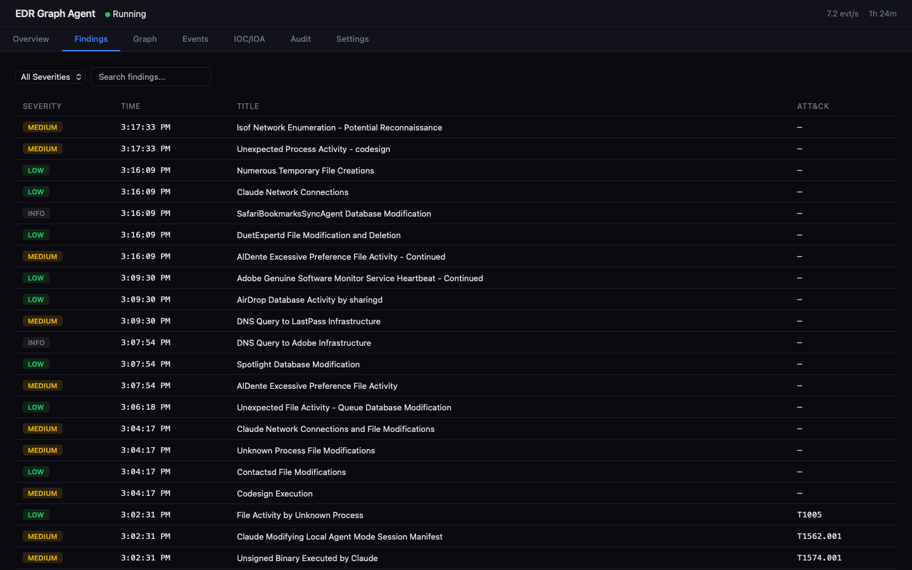
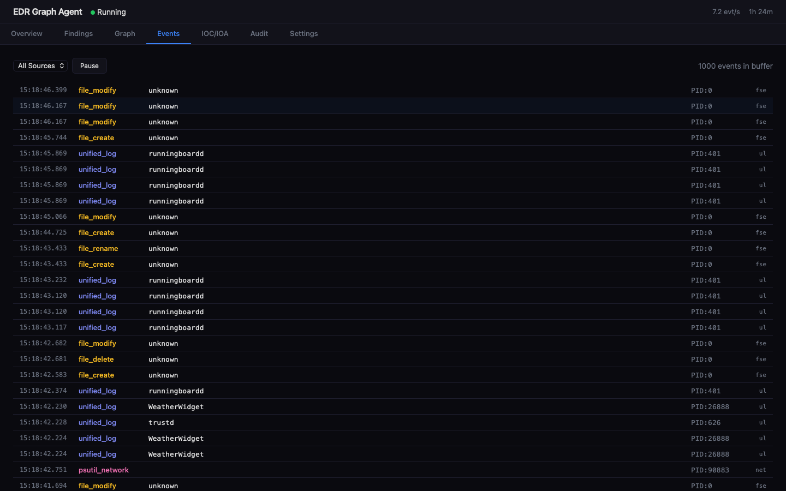
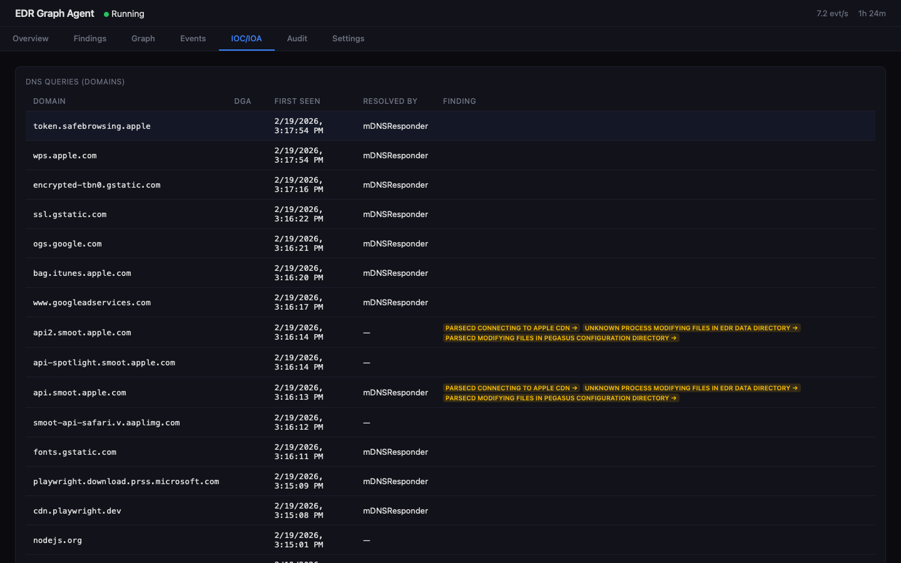

# EDR Graph Agent


> **Disclaimer:** This software is provided for **educational and research purposes only**. It is not a certified or commercially supported security product. Use at your own risk. The authors assume no liability for any damage, data loss, or legal consequences resulting from the use or misuse of this software. By using this software, you agree that you are solely responsible for ensuring compliance with applicable laws and regulations in your jurisdiction. Always obtain proper authorization before deploying monitoring or response tools on any system.

**edr-graph** is an advanced, cross-platform Endpoint Detection and Response (EDR) agent. It bridges the gap between deterministic local enforcement and asynchronous, AI-driven threat hunting. Built around an embedded Kuzu graph database, it maps OS-level telemetry into temporal attack chains and uses a dual-pipeline architecture to contain threats in milliseconds while leveraging Gemma-3 to analyze novel tradecraft.

<!-- Screenshot: Dashboard overview showing status cards, recent findings, and event stream -->


---

## Architecture

> **[Filtering Pipeline & Rules of Engagement](docs/ARCHITECTURE/filtering_pipeline.md)** — How the three evaluation stages work, what chain context is available at each stage, and how to write rules without causing friendly fire.

```
┌──────────────────────────────────────────────────────────────────────────────┐
│                           EDR Graph Agent                                    │
│                                                                              │
│  ┌─────────────┐   ┌──────────────┐   ┌──────────────┐   ┌──────────────┐  │
│  │  Collectors  │──▶│  Normalizer  │──▶│  Processor   │──▶│  Graph DB    │  │
│  │  (per-OS)   │   │  (OCSF)      │   │  (entities + │   │  (Kuzu)      │  │
│  └─────────────┘   └──────────────┘   │   fast-path)  │   └──────┬───────┘  │
│        │                               └──────┬───────┘          │          │
│        ▼                                      │ (blocked)        ▼          │
│  ┌─────────────┐   ┌──────────────────────────┼───────────────────────────┐ │
│  │  SQLite     │   │                 LLM Analyzer                         │ │
│  │  Queue      │   │  ┌──────────┐  ┌───────────┐  ┌──────────────────┐  │ │
│  │  + Findings │   │  │ Preflight│─▶│ Tool-Use  │─▶│ Finding Builder  │  │ │
│  │  + Audit    │   │  │ (novelty)│  │ Loop (5x) │  │ + Chain Context  │  │ │
│  └─────────────┘   │  └──────────┘  └───────────┘  └──────────────────┘  │ │
│                     │       │          │ ▲                                 │ │
│                     │       │          ▼ │                                 │ │
│                     │  ┌────────────────────────────────────┐             │ │
│                     │  │ Tools: IP Geo │ WHOIS │ MITRE      │             │ │
│                     │  │ AbuseIPDB │ VT │ Graph │ LOLBAS    │             │ │
│                     │  └────────────────────────────────────┘             │ │
│                     └────────────────────────────────────────────────────┘  │
│                                          │                                  │
│                                          ▼                                  │
│  ┌───────────────────────────────────────────────────────────────────────┐  │
│  │                      Response Engine  ◀── fast-path (skip LLM)        │  │
│  │  Severity ──▶ Baseline/Allow/Block ──▶ Approval ──▶ Execute ──▶ Audit │  │
│  │                                                                       │  │
│  │  Actions: Suspend │ Terminate │ Isolate Network │ Block IP            │  │
│  │           Quarantine File │ DNS Sinkhole │ Panic Isolate              │  │
│  └───────────────────────────────────────────────────────────────────────┘  │
│                                                                              │
│  ┌──────────────┐  ┌────────────┐  ┌─────────────┐  ┌────────────────────┐ │
│  │  Dashboard   │  │  Tray Icon │  │  Prometheus  │  │  Tamper Detection  │ │
│  │  (FastAPI)   │  │  (macOS)   │  │  Metrics     │  │  (SHA-256 verify)  │ │
│  └──────────────┘  └────────────┘  └─────────────┘  └────────────────────┘ │
└──────────────────────────────────────────────────────────────────────────────┘
```

### Pipeline Flow

1. **Collect** — Platform-native collectors gather process, network, file, DNS, and registry events
2. **Normalize** — Raw events are standardized to OCSF (Open Cybersecurity Schema Framework)
3. **Extract & Enforce** — Entities are extracted and checked against the synchronous fast-path blocklist. Matches are blocked instantly. Non-blocked entities are written to the Kuzu property graph
4. **Analyze** — An LLM with tool-use capabilities investigates novel behaviors using graph context, threat intel, and external APIs
5. **Respond** — A policy engine maps severity to actions, checks baselines/allowlists, requests approval, executes, and audits everything

---

## Key Features

### Graph-Based Attack Chain Correlation

Every telemetry event is decomposed into entities and relationships in a [Kuzu](https://kuzudb.com) property graph. This enables reconstructing full attack chains — from initial process spawn to C2 communication — by walking graph edges rather than searching flat logs.

**Graph Schema**: 6 node types, 12 relationship types:

```
(:User)-[:SPAWNED]->(:Process)-[:CONNECTED_TO]->(:IP)
                              |-[:RESOLVED]->(:Domain)-[:RESOLVES_TO]->(:IP)
                              |-[:CREATED_FILE|MODIFIED_FILE|DELETED_FILE]->(:File)
                              |-[:CREATED_REG|MODIFIED_REG]->(:RegistryKey)
```

<!-- Attack chain view: user identity, process ancestry, findings with Allow/Block, code signing -->


<!-- User-enriched chain: user badge, process ancestry, IOCs, network connections -->



### LLM Threat Analyzer with Agentic Tool Use

The analyzer uses an LLM (Gemma3-27B via DeepInfra) in an agentic tool-use loop to investigate suspicious behaviors. Rather than simple pattern matching, the LLM reasons about process behavior in the context of full attack chains and iteratively calls investigation tools.

**Investigation tools available to the LLM:**

| Tier | Tool | Source |
|------|------|--------|
| 1 | `ip_geolocation` | Free API — country, ISP, ASN, proxy/hosting classification |
| 1 | `reverse_dns` | Socket lookup |
| 1 | `whois_lookup` | WHOIS registry |
| 2 | `abuseipdb_check` | AbuseIPDB API (with graceful fallback) |
| 2 | `virustotal_lookup` | VirusTotal API (with graceful fallback) |
| 3 | `mitre_attack_lookup` | Local — bundled MITRE ATT&CK technique database |
| 3 | `graph_context_query` | Local — query the Kuzu graph for entity relationships |
| 3 | `lolbins_lookup` | Local — Living-off-the-Land binary detection |

### Graph as LLM Gatekeeper

A typical endpoint generates thousands of events per minute. Sending all of them to an LLM would be prohibitively expensive and slow. The graph database acts as a **gatekeeper** — only events that represent genuinely novel behavior pass through to the LLM.

**How it works:** Before any event reaches the LLM, a preflight filter queries the Kuzu graph to check whether the behavior has been seen before:

- **Process events** — Has this process name been spawned more than *N* times? (`MATCH (u:User)-[:SPAWNED]->(p:Process) WHERE p.name = $name`)
- **Network events** — Has this process connected to this IP before? (`MATCH (p:Process)-[:CONNECTED_TO]->(ip:IP)`)
- **Auth events** — Has this user authenticated from this source before?

If the graph edge count exceeds a configurable threshold (default: 5), the event is routine and gets dropped silently. Only novel relationships — a process connecting to a never-before-seen IP, a new process spawning for the first time — are forwarded to the LLM for investigation.

**Additional filtering layers:**
- A per-platform baseline of ~80 known system processes (e.g. `launchd`, `sshd`, `svchost.exe`) is dropped before the graph query, unless the process has unusual command-line arguments
- The agent's own processes are excluded via regex matching
- Tool results within each LLM analysis session are cached to avoid redundant API calls

**Result:** In practice, **~1-5% of events reach the LLM**. This keeps API costs minimal while ensuring that genuinely suspicious behavior — the first time `curl` pipes to `sh`, or a process connects to an IP in a threat intel feed — always gets investigated.

### Multi-Platform Telemetry Collection

| Platform | Collectors |
|----------|-----------|
| **macOS** | Unified Log, FSEvents, DNS interception (tcpdump), persistence polling (LaunchAgents/Daemons), connection metadata (tcpdump SYN), process enrichment, Endpoint Security stub |
| **Windows** | ETW (kernel events), Event Log (Security/System/Sysmon), registry monitoring |
| **Linux** | auditd (syscall tracing), journald, syslog, auth.log |
| **Cross-platform** | psutil (process/network polling), TLS SNI extraction, JA3 fingerprinting |

All raw events are normalized to [OCSF](https://schema.ocsf.io/) event classes (ProcessActivity, NetworkActivity, DnsActivity, FileActivity, RegistryActivity, Authentication) before entering the pipeline.

### Response Engine with Human-in-the-Loop

A three-mode response engine that maps LLM severity verdicts to automated or supervised actions:

| Mode | Behavior |
|------|----------|
| **Learning** | Records all observed behaviors to a baseline. Never blocks. |
| **Passive** | Alerts on threats. No enforcement. |
| **Active** | Enforces response actions with baseline/allowlist/blocklist filtering. |

**Response actions:**

| Action | Description | Platforms |
|--------|-------------|-----------|
| `ALERT` | Dashboard + tray notification | All |
| `SUSPEND_PROCESS` | SIGSTOP / NtSuspendProcess | All |
| `TERMINATE_PROCESS` | SIGKILL / TerminateProcess | All |
| `ISOLATE_NETWORK` | Block all network for a PID | pf / iptables / netsh |
| `BLOCK_CONNECTION` | Block specific IP:port | pf / iptables / netsh |
| `QUARANTINE_FILE` | Move to quarantine, strip perms, log chain of custody | All |
| `DNS_SINKHOLE` | Redirect domain to 127.0.0.1 | All |
| `PANIC_ISOLATE` | Emergency: block all network traffic | All |

**Active mode evaluation order:**
1. **Blocklist** — force-respond even if baselined (e.g., known C2 indicators)
2. **Allowlist** — skip response for known-good behaviors
3. **Baseline** — skip response for behaviors observed during learning
4. **Policy** — map severity to response actions, check protected process list, request approval

**Protected process list** prevents the agent from terminating system-critical processes (`launchd`, `csrss.exe`, `systemd`, `sshd`, etc.) regardless of severity.

### Synchronous Fast-Path Blocklist (EPP)

The fast-path enforcer evaluates blocklist rules **synchronously in the processor pipeline**, immediately after entity extraction — before the event reaches the graph database or LLM analyzer.

**How it works:**

- Blocklist rules are compiled into O(1) in-memory structures: IP hash sets, domain hash sets, CIDR prefix lists, and glob pattern lists
- On every event, entities are checked in evaluation order: **IPs → CIDRs → domains → process names → file paths → chain patterns**
- On match: a CRITICAL finding is generated and the response engine is triggered immediately, **skipping both the graph write and LLM analysis**
- The compiled rule set is thread-safe with periodic SQLite refresh (5s default) and instant invalidation when rules are added or removed via the dashboard

**Why it matters:** Known-bad indicators (C2 IPs, malicious domains, prohibited process chains) are blocked in sub-millisecond time — no waiting for the LLM analysis cycle. This turns the EDR from a detect-and-alert system into a real-time enforcement point for known threats.

The dashboard shows a **fast-blocked event counter** on the Overview tab when events have been blocked by this path.

### User Identity Enrichment

Every process in the graph is linked to the user who spawned it. The agent resolves the owning user for each process via OS-level APIs (`stat /proc/<pid>` on Linux, `ps -o user=` on macOS, token query on Windows) and writes `(:User)-[:SPAWNED]->(:Process)` edges into the graph.

This enables:
- **Per-user scoping** — findings and attack chains show which user account was involved
- **User-aware rules** — allow/block rules can target specific users (see below)
- **Cross-user correlation** — detect lateral movement where one user's process spawns activity under another account

The dashboard displays the user in the **Target Process** details and as a colored badge at the start of the **Process Chain**.

### Chain-Aware Allow/Block Rules

Rules can be scoped to specific process ancestry chains, not just flat attributes. This prevents overly broad allowlists:

```
# Allow Claude to connect to Anthropic IPs — but ONLY through this chain
Rule: dst_ip: 18.97.36.79  [chain: launchd > Claude]

# A different process connecting to the same IP is NOT allowlisted
malware > curl → 18.97.36.79  ← still triggers response
```

**Chain pattern syntax:**
- `>` separates chain steps
- `*` matches exactly one step
- `**` matches zero or more steps
- Named steps use glob matching (case-insensitive)
- `USER:<name>` matches a user entry (e.g., `USER:thomas`, `USER:root`)

**Per-user rules** — chain patterns include the owning user with a `USER:` prefix, allowing rules scoped to specific accounts:

```
USER:thomas > ** > OrbStack Helper   # Block thomas using OrbStack Helper
USER:thomas > **                     # Block all activity by user thomas
USER:* > ** > osascript              # Allow osascript for any user
** > curl                            # Block curl regardless of user
```

The `USER:` prefix prevents ambiguity when a username collides with a process name (e.g., `postgres` the user vs `postgres` the binary).

**More examples:**
```
Terminal > ** > caffeinate        # Terminal ancestry, any depth
bash > curl                       # Direct parent
launchd > * > bash > python*     # One hop from launchd, then bash, then python*
```

<!-- Allowlist rules with chain_filter scoping visible in Settings -->


### Process Hierarchy Intelligence

A built-in knowledge base of expected parent-child process relationships flags anomalous process ancestry. For example, `osascript` is expected to be spawned by shells (`bash`, `zsh`) — if it appears under an unexpected parent, the analyzer is alerted before the LLM even runs. This catches process injection and LOLBin abuse patterns that are invisible to signature-based detection.

### Real-Time Threat Intelligence

Eight open-source IOC feeds are downloaded, cached, and matched against live telemetry:

| Feed | Coverage |
|------|----------|
| **Feodo Tracker** | Botnet C2 server IPs |
| **Stamparm IPsum** | Aggregated IP reputation (multi-source) |
| **Blocklist.de** | Attack source IPs |
| **C2 Tracker** | Active C2 framework IPs (Cobalt Strike, Sliver, etc.) |
| **Emerging Threats** | Compromised host IPs |
| **ThreatFox** | Recent malware IOCs (IPs, domains, URLs) |
| **URLhaus** | Malware distribution URLs |
| **MalBazaar** | Malware sample SHA-256 hashes |

Feeds are refreshed every 4 hours (configurable). Matches are flagged before reaching the LLM and included as pre-enrichment context.

### Lightweight Real-Time Detectors

These run synchronously on every event (sub-millisecond) — no LLM needed:

- **DGA Detection** — Entropy analysis, consonant-vowel ratios, and English bigram frequency scoring to identify algorithmically generated domains
- **Persistence Detection** — Monitors LaunchAgent/LaunchDaemon creation (macOS), Registry Run keys (Windows), cron/systemd modifications (Linux)
- **IOC Feed Matching** — Real-time comparison of IPs, domains, and file hashes against threat intelligence
- **Code Signing Verification** — Apple certificate chain validation and notarization checks (macOS)

### Dashboard

A single-page web dashboard served by FastAPI on `localhost:9200`:

- **Overview** — Status cards (uptime, event rate, queue depth), severity breakdown, recent findings
- **Findings** — Severity-filtered finding list with full detail, evidence events, and IOC extraction
- **Graph Investigation** — Attack chain visualization with user identity, process ancestry, network connections, and code signing status
- **Events** — Live event stream with type filtering and source selection
- **IOC/IOA** — DNS query log with DGA scoring, external IP connections with geolocation, and finding correlation
- **Audit** — Complete audit trail of all response actions taken
- **Settings** — Response mode control, baseline statistics, allowlist/blocklist CRUD, network controls, DNS sinkhole management, panic mode, threat intel feed stats

<!-- Findings list with severity, MITRE ATT&CK mappings, timestamps -->


<!-- Live event stream with type-colored badges and source filtering -->


<!-- IOC/IOA tab: DNS queries, DGA scoring, domain-to-finding correlation -->


### Self-Protection

- **Tamper Detection** — SHA-256 baseline of all agent source files at startup, verified every 60 seconds. Modifications trigger alerts.
- **Protected Process List** — Agent and OS-critical processes cannot be terminated by the response engine.
- **Watchdog/Heartbeat** — Separate heartbeat thread writes timestamps to disk. External watchdog can detect agent failure.

### Observability

Prometheus metrics exported on port 9100:

```
edr_events_processed_total{source, event_type}
edr_events_dropped_total{source, reason}
edr_event_processing_latency_seconds
edr_llm_call_latency_seconds
edr_llm_verdicts_total{severity}
edr_dga_detections_total
edr_persistence_detections_total{type}
edr_events_fast_blocked_total
edr_response_actions_total{action, result}
edr_tamper_detections_total{event_type}
edr_agent_uptime_seconds
edr_queue_depth
```

macOS system tray icon provides live status, native notifications for HIGH/CRITICAL findings, and quick controls (pause/resume, open dashboard).

---

## Security Framework

```
                        ┌─────────────────────────┐
                        │    Threat Intelligence   │
                        │  8 IOC feeds, refreshed  │
                        │  every 4h (~50K indicators│
                        └────────────┬────────────┘
                                     │
┌──────────────┐    ┌────────────────▼────────────────┐    ┌──────────────────┐
│  Lightweight  │    │       LLM Threat Analyzer       │    │  Response Engine  │
│  Detectors    │    │                                  │    │                  │
│  ─────────── │    │  Pre-enrichment (IOC, geo, MITRE)│    │  Blocklist       │
│  DGA scoring  │───▶│  Tool-use loop (up to 5 rounds) │───▶│  Allowlist       │
│  Persistence  │    │  Graph context (attack chains)   │    │  Baseline        │
│  IOC matching │    │  Severity verdict + findings     │    │  Approval gate   │
│  Code signing │    │                                  │    │  Action executor │
└──────────────┘    └──────────────────────────────────┘    │  Audit trail     │
                                                            └────────▲─────────┘
                                                                     │
┌───────────────────────────────────────────────────────────────┐    │
│  Fast-Path Blocklist Enforcer (in Processor)                  │────┘
│  IPs → CIDRs → domains → process names → file paths → chains │
│  O(1) compiled in-memory structures, sub-ms evaluation        │
└───────────────────────────────────────────────────────────────┘
```

**Defense-in-depth layers:**

1. **Collection** — Native OS APIs for high-fidelity telemetry (ETW, auditd, FSEvents, Unified Log)
2. **Normalization** — OCSF standardization ensures consistent analysis regardless of platform
3. **Graph Correlation** — Entity relationships reveal multi-step attack patterns invisible in flat logs
4. **Real-Time Detection** — DGA, persistence, IOC, and fast-path blocklist detectors catch known patterns immediately
5. **Fast-Path Enforcement** — Synchronous blocklist evaluates IPs, domains, CIDRs, process names, file paths, and chain patterns in the processor hot loop — blocking known threats instantly without LLM analysis
6. **AI Reasoning** — LLM analyzes novel behaviors with graph context and external intelligence
7. **Response Orchestration** — Graduated actions (log → alert → suspend → terminate → isolate) with approval gates
8. **Behavioral Baseline** — Learning mode builds a profile of normal behavior; active mode only responds to deviations
9. **Self-Protection** — Tamper detection, protected process list, heartbeat monitoring

---

## Architectural Innovations

Building an LLM-driven graph EDR in user-space requires solving complex performance and resource constraints. This agent implements several advanced architectural patterns:

**The Dual-Pipeline (EPP + EDR):** To prevent LLM latency from delaying critical enforcement, the agent utilizes a Synchronous Fast Path. Known IOCs and blocked behavioral chains are compiled into O(1) in-memory Python sets. This allows the agent to evaluate and trigger containment for known threats in milliseconds before they enter the graph or wake up the LLM.

**Deterministic Memory Governance:** Graph databases are notorious for memory bloat. This agent enforces a strict 512 MB Kuzu buffer pool cap, runs a background Graph Reaper thread that prunes edges older than a configurable TTL (24h default) every hour, and separately prunes processed events from the SQLite queue every 5 minutes — maintaining a stable memory footprint even under heavy OS event firehoses.

**Identity-Aware Chain Matching:** Legacy EDRs block binaries; this agent blocks identities. By enforcing strict bottom-up PID attribution and caching OS-level user contexts in RAM, the agent allows rules scoped to specific users (e.g., `USER:intern > ** > bash` is blocked, while `USER:sysadmin > ** > bash` is allowed).

**LLM Cost Optimization:** A preflight novelty filter evaluates the temporal graph before invoking the AI. If an exact process chain has been seen recently, it is dropped, reducing LLM API costs significantly while preserving full forensic visibility in the database.

### Performance & Reliability

**High-Efficiency Hot Loop:** The Python processor is heavily optimized, utilizing O(1) hash lookups and memory-safe structures to evaluate telemetry with sub-millisecond local latency, ensuring the agent adds virtually zero overhead to the host CPU.

**Fail-Open Resilience:** If the external LLM API times out or the host loses internet connectivity, the agent degrades gracefully. The async threat-hunter pauses, but the Synchronous Fast Path remains active locally, ensuring the endpoint remains protected from known threats.

**Test Coverage:** The pipeline is hardened by 546+ automated tests, verifying everything from OS-level psutil event extraction to complex synchronous chain matching.

---

## Tech Stack

| Component | Technology |
|-----------|-----------|
| Language | Python 3.13 |
| Graph Database | [Kuzu](https://kuzudb.com) (embedded, columnar) |
| Event Queue / Audit | SQLite (WAL mode, thread-safe) |
| LLM | Gemma3-27B via DeepInfra (OpenAI-compatible API) |
| Web Dashboard | FastAPI + vanilla JS SPA |
| Metrics | Prometheus client |
| Config | Pydantic + YAML |
| Process Info | psutil |
| macOS Tray | rumps |
| Logging | structlog (JSON/text) |
| Testing | pytest (~550 tests) |

---

## Quick Start

```bash
# Clone and set up
git clone <repo-url> && cd edr-graph
python3 -m venv .venv && source .venv/bin/activate
pip install -r requirements.txt

# Configure (optional — works with defaults)
export DEEPINFRA_API_KEY="your-key-here"

# Run (requires root for network capture)
sudo .venv/bin/python3 -m agent.main --config config.yaml --log-level INFO
```

Dashboard opens at `http://localhost:9200`. The agent starts in **passive** mode by default — switch to **learning** to build a behavioral baseline, then **active** to enforce.

---

## Usage Guide

### Response Modes

The agent operates in one of three modes, switchable at runtime via the dashboard **Settings** tab or the API:

| Mode | What happens on a threat | When to use |
|------|-------------------------|-------------|
| **Learning** | Records all observed behaviors to a baseline. No alerts, no enforcement. | First deployment — build a profile of normal activity before enabling detection. |
| **Passive** | Generates findings and alerts (dashboard + tray notifications). No enforcement actions. | Day-to-day monitoring when you want visibility without automated response. |
| **Active** | Evaluates findings against blocklist → allowlist → baseline → policy, then executes response actions (suspend, terminate, isolate, etc.) with approval gates. | Production enforcement — the agent actively responds to threats. |

### Recommended Workflow

1. **Start in Learning mode** — Let the agent observe normal behavior and build a baseline.
   - **Development machines**: 24 hours is usually sufficient
   - **Servers / production hosts**: 1–7 days to capture periodic jobs, maintenance windows, and varied workloads
2. **Switch to Passive mode** — Review findings in the dashboard. Add allowlist rules for known-good behaviors that generate false positives. Add blocklist rules for known-bad indicators you want blocked immediately.
3. **Switch to Active mode** — The agent now enforces. Baselined behaviors are silently passed, allowlisted behaviors are skipped, blocklisted behaviors are blocked instantly (via the fast-path enforcer), and novel threats go through the LLM → policy → approval → action pipeline.

### Switching Modes

**Dashboard:** Settings tab → Response Mode dropdown → select mode.

**API:**
```bash
curl -X POST http://localhost:9200/api/response/mode \
  -H 'Content-Type: application/json' \
  -d '{"mode": "active"}'
```

### Adding Blocklist / Allowlist Rules

**Dashboard:** Settings tab → scroll to Blocklist or Allowlist section → fill in rule type, pattern, and optional chain filter → Add.

**API:**
```bash
# Block a specific IP
curl -X POST http://localhost:9200/api/response/blocklist \
  -H 'Content-Type: application/json' \
  -d '{"rule_type": "dst_ip", "pattern": "203.0.113.50", "description": "Known C2 server"}'

# Block a process chain pattern
curl -X POST http://localhost:9200/api/response/blocklist \
  -H 'Content-Type: application/json' \
  -d '{"rule_type": "chain_pattern", "pattern": "** > curl > sh", "description": "Pipe curl to shell"}'

# Allowlist a known-good connection with chain scope
curl -X POST http://localhost:9200/api/response/allowlist \
  -H 'Content-Type: application/json' \
  -d '{"rule_type": "dst_ip", "pattern": "18.97.36.79", "chain_filter": "launchd > Claude", "description": "Claude → Anthropic API"}'
```

Rule types: `dst_ip`, `dst_cidr`, `domain`, `process_name`, `file_path`, `chain_pattern`. See [Chain-Aware Allow/Block Rules](#chain-aware-allowblock-rules) for the full chain pattern syntax.

### What Happens When a Threat Is Detected

| Stage | Learning | Passive | Active |
|-------|----------|---------|--------|
| Fast-path blocklist match | Skipped | Alert only | **Block immediately** — CRITICAL finding + response action |
| LLM severity verdict | Recorded to baseline | Finding + alert | Finding → blocklist → allowlist → baseline → policy → approval → action |
| Response action execution | Never | Never | Executes (with approval gate for destructive actions unless `auto_respond` is enabled) |

---

## Project Structure

```
edr-graph/
├── agent/
│   ├── main.py                 # Pipeline orchestration, thread management
│   ├── config.py               # Pydantic settings (YAML + env vars)
│   ├── collectors/             # 10+ platform-native event sources
│   ├── normalizer/             # OCSF normalization (6 event types)
│   ├── schema/                 # Kuzu DDL, SQLite DDL, OCSF types
│   ├── processor/              # Entity extraction, fast-path enforcement → graph writes
│   ├── graph/                  # Attack chain queries
│   ├── analyzer/               # LLM tool-use analyzer + preflight
│   ├── analysis/               # Lightweight detectors (DGA, persistence)
│   ├── enrichment/             # Code signing, IP reputation, process identity, allowlisting
│   ├── intel/                  # IOC feeds, MITRE ATT&CK, LOLBAS, process hierarchy
│   ├── response/               # Engine, actions, approval, baseline, network control
│   ├── dashboard/              # FastAPI server + SPA frontend
│   ├── platform/               # Tamper detection, Windows service
│   └── tray/                   # macOS menu bar integration
├── tests/                      # 42 test modules, ~550 tests
├── config.yaml                 # Runtime configuration
└── README.md
```

---

## Screenshots

| View | Description |
|------|-------------|
| [Dashboard Overview](docs/screenshots/dashboard-overview.png) | Status cards, active collectors, threat intel feed stats, recent findings |
| [Findings](docs/screenshots/findings.png) | Severity-filtered finding list with MITRE ATT&CK technique IDs |
| [Attack Chain](docs/screenshots/attack-chain.png) | User identity, process ancestry, code signing, Allow/Block per finding |
| [Attack Chain — Network](docs/screenshots/attack-chain-jsdelivr.png) | User-enriched chain with IOCs, network connections, and response actions |
| [Events](docs/screenshots/events.png) | Live event stream with type filtering (file, network, DNS, process) |
| [IOC/IOA](docs/screenshots/ioc-ioa.png) | DNS query log with DGA scoring and finding correlation |
| [Audit Trail](docs/screenshots/audit.png) | Response action audit log with timestamps and outcomes |
| [Settings](docs/screenshots/settings.png) | Response mode, baseline, allowlist/blocklist, network controls, threat intel |

---

## Platform Support

The agent builds and runs on macOS, Linux, and Windows. Each platform uses different OS-level telemetry sources and response mechanisms.

### Telemetry Sources

| Capability | macOS | Linux | Windows |
|------------|-------|-------|---------|
| **Process events** | Unified log + psutil | auditd (`execve`) + psutil | ETW Kernel-Process + Sysmon + psutil |
| **Network connections** | Unified log + psutil | auditd (`connect`) + psutil | ETW Kernel-Network + Sysmon + psutil |
| **DNS queries** | tcpdump (port 53) | — (via network events) | ETW DNS-Client |
| **File I/O** | FSEvents (no PID) + persistence poller | auditd (file watches) | ETW Kernel-File |
| **Registry** | N/A | N/A | ETW Kernel-Registry |
| **Authentication** | Unified log (authd, securityd) | syslog (auth.log) + auditd | Event Log Security |
| **TLS fingerprinting** | tcpdump (JA3 from ClientHello) | — | — |
| **Command line args** | sysctl KERN_PROCARGS2 | auditd / /proc | Sysmon / ETW |

### Response Actions

| Action | macOS | Linux | Windows |
|--------|-------|-------|---------|
| **Process suspend/resume** | SIGSTOP / SIGCONT | SIGSTOP / SIGCONT | NtSuspendProcess / NtResumeProcess (ctypes) |
| **Process terminate** | SIGKILL | SIGKILL | TerminateProcess (ctypes) |
| **Network isolation** | pf anchor rules (per-IP via lsof) | iptables `--pid-owner` (xt_owner) | netsh advfirewall (per-program) |
| **Connection blocking** | pf anchor rules | iptables destination match | netsh remoteip rules |
| **DNS sinkhole** | /etc/hosts + `killall -HUP mDNSResponder` | /etc/hosts + `systemd-resolve --flush-caches` | /etc/hosts |
| **Panic mode** | pf block-all except lo0 | iptables block-all except lo | netsh block-all except loopback |

### Deployment

| | macOS | Linux | Windows |
|--|-------|-------|---------|
| **Install** | Manual / LaunchDaemon | `deploy/install.sh` (systemd service) | `deploy/install.ps1` (Windows Service) |
| **Runs as** | Root (for tcpdump, pf) | systemd service (edr-graph user) | Windows Service (SYSTEM) |
| **Tray icon** | Menu bar via rumps | — | — |
| **Requirements** | Python 3.11+ | Python 3.11+, auditd | Python 3.11+, pywin32 |

### Known Platform Limitations

**macOS**
- File events from FSEvents do **not** include PID attribution. The Endpoint Security Framework (ESF) would provide this, but requires an Apple-issued `com.apple.developer.endpoint-security.client` entitlement only available to approved signed binaries. An ESF stub exists in the codebase but is not active.
- pf (packet filter) does not support per-PID network blocking. The agent works around this by using `lsof` to discover a process's active connections and blocking those specific IP:port pairs.
- No install script — intended to run directly or via a LaunchDaemon.

**Linux**
- Full auditd integration requires root or `CAP_AUDIT_READ` capability.
- Per-PID network isolation via iptables requires the `xt_owner` kernel module.
- No TLS fingerprinting (JA3) — currently macOS only.

**Windows**
- ETW (Event Tracing for Windows) provides the richest telemetry of all three platforms with kernel-level process, network, file, DNS, and registry events.
- Requires pywin32 for Windows Service integration and win32evtlog for Event Log access.
- Process suspend/resume uses undocumented `NtSuspendProcess`/`NtResumeProcess` via ctypes for forensic preservation of process state.

---

## Security Considerations

This project was built as a research EDR agent. The following are known limitations and design tradeoffs — not vulnerabilities — documented here for transparency.

### Dashboard Authentication

The dashboard binds to `127.0.0.1` (localhost only) and has no authentication. This is acceptable for a single-host research agent but would require authentication (e.g. API tokens, mTLS) before exposing to a network.

### Dashboard TLS

The dashboard serves over plain HTTP on localhost. Add a TLS reverse proxy if the dashboard is exposed beyond the loopback interface.

### LLM Tool URL Fetching

The LLM analyzer has HTTP fetch tools that retrieve URLs during investigation. These are intentional by design (the agent needs to query threat intel APIs). The URLs are constrained to configured API endpoints, not arbitrary user input.

### JA3 Fingerprinting Uses MD5

JA3/JA3S TLS fingerprinting uses MD5 hashes. This is required by the [JA3 specification](https://github.com/salesforce/ja3) for compatibility with existing threat intel databases — it is not used for cryptographic security.

### Firewall Rule Injection (Fixed)

IP addresses passed to `pf`/`iptables`/`netsh` firewall commands are validated with `ipaddress.ip_address()` at both the API layer and the network control layer. Ports are validated to the 1-65535 range. This was identified during internal security testing and resolved prior to public release.

### Security Testing

The codebase has been scanned with:

| Tool | Result |
|------|--------|
| **bandit** (SAST) | No actionable findings (all flagged items are false positives — JA3 MD5, temp dir monitoring, parameterized SQL) |
| **pip-audit** | No vulnerable runtime dependencies |
| **ruff** | 0 lint issues |
| **Manual code review** | Parameterized SQL throughout, consistent XSS escaping, no `shell=True`, API keys from environment variables only |

---

## Licensing & Intellectual Property

**Patent Notice:** The Chain-Aware Ancestry Enforcement Engine architecture, including the Two-Tier Evaluation Engine and In-Memory Ancestry Acceleration, is **Patent Pending** (U.S. Provisional Patent Application No. 63/989,818).

**Dual-License Model:**
This software is released under the **GNU Affero General Public License v3.0 (AGPLv3)**. This permits free use, modification, and distribution for non-commercial, academic, and open-source projects, provided that all modifications and network-interacting derivative works are also open-sourced under the AGPLv3.

**Commercial & Enterprise Licensing:**
For proprietary enterprise EDR integration, commercial distribution, or to request an exemption from the AGPLv3 open-source requirements, a commercial license is required. Please contact the author to discuss commercial licensing or IP acquisition.
