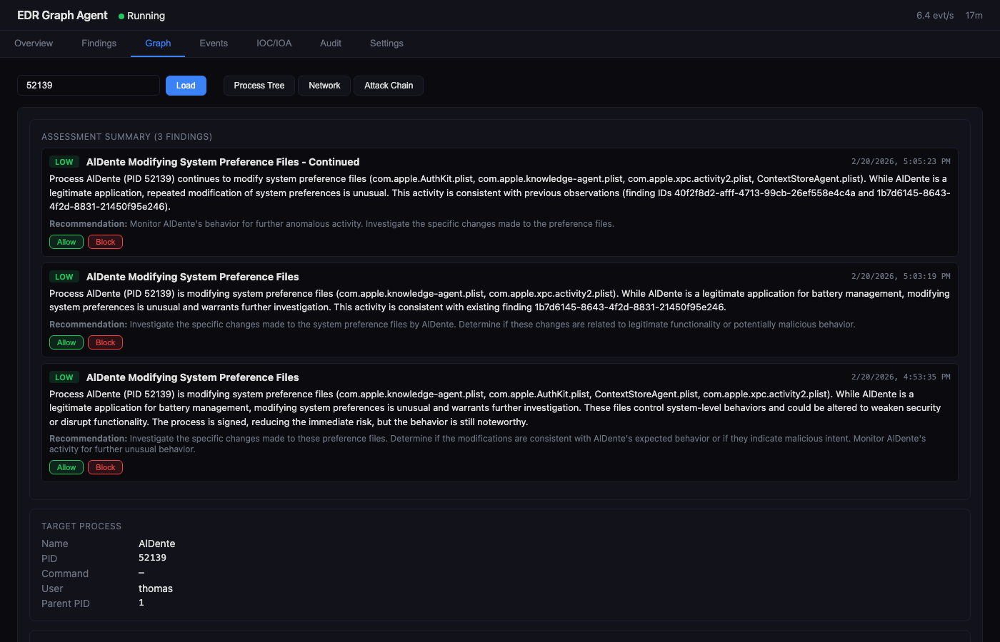
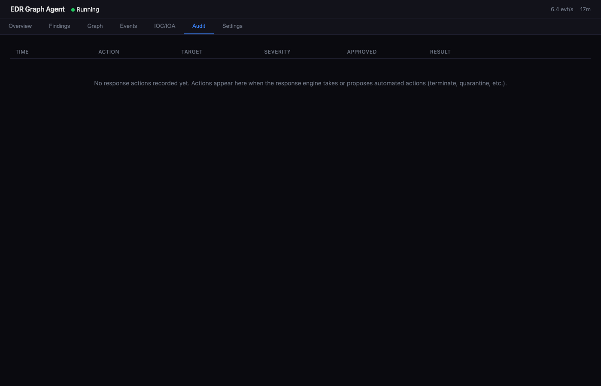

# The Telemetry Pipeline

eDR-Graph processes endpoint telemetry through a 7-stage pipeline, from raw OS events to automated response actions. Each stage is designed for a specific job, and the ordering is critical for both performance and correctness.

## Pipeline Diagram

```
┌─────────────┐   ┌──────────────┐   ┌──────────────┐   ┌──────────────┐
│  Collectors  │──▶│  Normalizer  │──▶│  Processor   │──▶│  Graph DB    │
│  (per-OS)   │   │  (OCSF)      │   │  (entities + │   │  (Kuzu)      │
└─────────────┘   └──────────────┘   │   fast-path)  │   └──────┬───────┘
      │                               └──────┬───────┘          │
      ▼                                      │ (blocked)        ▼
┌─────────────┐   ┌──────────────────────────┼───────────────────────────┐
│  SQLite     │   │                 LLM Analyzer                         │
│  Queue      │   │  ┌──────────┐  ┌───────────┐  ┌──────────────────┐  │
│  + Findings │   │  │ Preflight│─▶│ Tool-Use  │─▶│ Finding Builder  │  │
│  + Audit    │   │  │ (novelty)│  │ Loop (5x) │  │ + Chain Context  │  │
└─────────────┘   │  └──────────┘  └───────────┘  └──────────────────┘  │
                  └──────────────────────────────────────────────────────┘
                                        │
                                        ▼
┌───────────────────────────────────────────────────────────────────────┐
│                      Response Engine  ◀── fast-path (skip LLM)        │
│  Severity ──▶ Baseline/Allow/Block ──▶ Approval ──▶ Execute ──▶ Audit │
└───────────────────────────────────────────────────────────────────────┘
```

---

## Stage 1: Collection

Platform-native collectors gather raw telemetry events and push them to the SQLite event queue.

| Platform | Collectors |
|----------|-----------|
| **Linux** | eBPF (execve, connect syscalls), auditd, journald, syslog, psutil |
| **macOS** | Unified Log, FSEvents, DNS interception (tcpdump), persistence polling, connection metadata (tcpdump SYN), psutil |
| **Windows** | ETW (kernel process/network/file/DNS/registry), Event Log (Security/System/Sysmon), psutil |
| **Cross-platform** | psutil (process + network polling), TLS SNI extraction, JA3 fingerprinting |

**eBPF startup probe (Linux):** At startup, the agent attempts to load an eBPF collector. If BPF loads successfully, psutil switches to `snapshot_only=True` mode — the first `collect()` call emits all current process state, and subsequent calls return `[]`. This prevents duplicate events when eBPF is handling real-time collection.

**Collector thread:** Runs in a daemon thread, polling at `collector.poll_interval` (default: 1s). Raw events are serialized to JSON and pushed to the SQLite queue in batches.

---

## Stage 2: Normalization

Raw events from different OS sources are standardized to [OCSF](https://schema.ocsf.io/) (Open Cybersecurity Schema Framework) event classes.

**6 OCSF event types:**

| OCSF Class | Description |
|------------|-------------|
| `ProcessActivity` | Process creation, termination, signals |
| `NetworkActivity` | TCP/UDP connections, listening sockets |
| `DnsActivity` | DNS queries and resolutions |
| `FileActivity` | File create, read, modify, delete |
| `RegistryActivity` | Windows registry key operations |
| `Authentication` | Login events (SSH, local, AD) |

**~30 source → normalizer mappings** route each raw event source to the correct normalizer function. For example:

- `psutil_process` → `normalize_process`
- `ebpf_execve` → `normalize_process`
- `etw_dns` → `normalize_dns`
- `connection_metadata` → `normalize_network`

Events that cannot be normalized are silently dropped with a counter metric (`edr_events_dropped_total{reason="normalization_returned_none"}`).

---

## Stage 3: Entity Extraction

Normalized OCSF events are decomposed into graph entities (nodes) and relationships (edges).

**6 node types:**

| Node | Key Properties |
|------|---------------|
| `User` | id, name, uid |
| `Process` | id, name, pid, cmd_line, exe_path, hostname, parent_pid, code_signed, signing_authority |
| `IP` | id, address, is_private, country, isp, asn, classification |
| `Domain` | id, name, is_dga_candidate, tld |
| `File` | id, path, hash_sha256, size |
| `RegistryKey` | id, path, value_name, value_data |

**12+ relationship types:**

```
(:User)-[:SPAWNED]->(:Process)
(:Process)-[:CONNECTED_TO]->(:IP)
(:Process)-[:RESOLVED]->(:Domain)
(:Domain)-[:RESOLVES_TO]->(:IP)
(:Process)-[:CREATED_FILE]->(:File)
(:Process)-[:MODIFIED_FILE]->(:File)
(:Process)-[:READ_FILE]->(:File)
(:Process)-[:DELETED_FILE]->(:File)
(:Process)-[:CREATED_REG]->(:RegistryKey)
(:Process)-[:MODIFIED_REG]->(:RegistryKey)
(:Process)-[:DELETED_REG]->(:RegistryKey)
(:Process)-[:LISTENING_ON]->(:IP)
```

**Process node ID format:** `{hostname}:{pid}:{create_time_epoch}` — guarantees uniqueness even across PID reuse.

**Enrichment during extraction:**

- **Parent PID resolution** via psutil (cached per PID)
- **User identity** resolution (OCSF actor → psutil fallback → UID map)
- **Code signing verification** (macOS: Apple certificate chain validation)
- **DGA detection** on DNS domains (entropy analysis, consonant-vowel ratios, bigram frequency)
- **Persistence detection** on file/registry events (LaunchAgent/Daemon, Run keys, cron/systemd)


---

## Stage 4: Filtering

Three filtering stages reduce noise before events reach the graph or the LLM.

For full details, see [Filtering Pipeline & ROE](filtering_pipeline.md).

**Stage 4a — Agent Self-Filter:** Events generated by the agent's own PID are suppressed.

**Stage 4b — Pre-Graph Allowlist:** High-volume, known-safe events are permanently dropped before graph insertion. Supports `process_name`, `dst_ip`, `dst_cidr`, `domain`, `file_path` rules. Chain context is NOT available at this stage.

**Stage 4c — Baseline Graph Gating:** In non-learning modes, edges that were observed during the learning phase are gated (not written to the graph), reducing graph size and LLM noise. Edge-level precision — individual relationships are gated, not entire events.

!!! warning
    The Pre-Graph Allowlist permanently drops events. Do not put dual-use binaries (`python`, `bash`, `curl`) here — it will blind the EDR to all activity from those processes. Use this stage exclusively for deafening, harmless noise.

---

## Stage 5: Graph Write Queue

Kuzu is a single-writer database. To safely handle concurrent writes from the processor and reaper threads, eDR-Graph uses an MPSC (multi-producer, single-consumer) write queue.

**Architecture:**

- All threads submit `WriteJob` objects to a thread-safe Python queue
- A dedicated `graph-writer` thread is the **only** thread that writes to Kuzu
- Job types: `ENTITY_BATCH`, `IP_ENRICHMENT`, `PRUNE_EDGES`, `PRUNE_FULL`, `PURGE_BASELINE`, `PURGE_BY_RULE`, `SHUTDOWN`
- The `GraphBuilder` creates a single Kuzu connection in the writer thread and performs all upserts

**Entity batch writes** use Kuzu's `MERGE` semantics — entities are created if new, or updated (last_seen timestamp) if they already exist.

---

## Stage 6: LLM Analysis

The analyzer thread runs on a configurable interval (default: 60s) and investigates novel behaviors using an LLM with agentic tool use.

### Preflight Novelty Filter

Before any event reaches the LLM, a preflight filter queries the Kuzu graph to check whether the behavior has been seen before:

- **Process events** — Has this process name been spawned more than N times?
- **Network events** — Has this process connected to this IP before?
- **Auth events** — Has this user authenticated from this source before?

If the graph edge count exceeds a configurable threshold (default: 5), the event is routine and is dropped. Only novel relationships pass through.

**Result:** In practice, **~1-5% of events reach the LLM**, keeping API costs minimal.

### Agentic Tool-Use Loop

The LLM (Gemma3-27B via DeepInfra) runs in an agentic tool-use loop with up to 5 iterations per analysis batch:

| Tier | Tool | Source |
|------|------|--------|
| 1 | `ip_geolocation` | Free API — country, ISP, ASN, proxy/hosting flags |
| 1 | `reverse_dns` | Socket lookup |
| 1 | `whois_lookup` | WHOIS registry |
| 2 | `abuseipdb_check` | AbuseIPDB API (with graceful fallback) |
| 2 | `virustotal_lookup` | VirusTotal API (with graceful fallback) |
| 3 | `mitre_attack_lookup` | Local — bundled MITRE ATT&CK technique database |
| 3 | `graph_context_query` | Local — query the Kuzu graph for entity relationships |
| 3 | `lolbins_lookup` | Local — Living-off-the-Land binary detection |

Tool results within each analysis session are cached to avoid redundant API calls.

### Finding Builder

The LLM produces structured findings with:

- Severity level (informational, low, medium, high, critical)
- MITRE ATT&CK technique mapping
- Attack chain reconstruction
- Affected entities and PIDs
- IOC extraction (IPs, domains, file hashes)
- Recommended response actions

---

## Stage 7: Response Engine

The response engine maps findings to automated or supervised actions based on the current operating mode.

### Three Operating Modes

| Mode | Behavior |
|------|----------|
| **Learning** | Records all behaviors to a baseline. No alerts, no enforcement. |
| **Passive** | Generates findings and alerts (dashboard + tray). No enforcement. |
| **Active** | Full enforcement with baseline/allowlist/blocklist filtering and approval gates. |

### 8 Response Actions

| Action | Description | Platforms |
|--------|-------------|-----------|
| `ALERT` | Dashboard + tray notification | All |
| `SUSPEND_PROCESS` | SIGSTOP / NtSuspendProcess | All |
| `TERMINATE_PROCESS` | SIGKILL / TerminateProcess | All |
| `ISOLATE_NETWORK` | Block all network for a PID | pf / iptables / netsh |
| `BLOCK_CONNECTION` | Block specific IP:port | pf / iptables / netsh |
| `QUARANTINE_FILE` | Move to quarantine, strip perms, chain of custody | All |
| `DNS_SINKHOLE` | Redirect domain to 127.0.0.1 | All |
| `PANIC_ISOLATE` | Emergency: block all network traffic | All |

### Active Mode Evaluation Order

1. **Blocklist** — Force-respond even if baselined (e.g., known C2 indicators)
2. **Allowlist** — Skip response for known-good behaviors
3. **Baseline** — Skip response for behaviors observed during learning
4. **Policy** — Map severity to actions, check protected process list, request approval

**Protected process list** prevents the agent from terminating system-critical processes (`launchd`, `csrss.exe`, `systemd`, `sshd`, etc.) regardless of severity.





---

## Thread Architecture

The agent runs 7+ daemon threads coordinated by a central shutdown event:

| Thread | Role |
|--------|------|
| `collector` | Poll OS-native telemetry sources |
| `processor` | Normalize → extract → filter → submit to write queue |
| `graph-writer` | Single-writer Kuzu consumer (entity upserts, prune jobs) |
| `analyzer` | Periodic LLM analysis of novel events |
| `reaper` | Pressure-driven graph pruning (TTL-based, emergency thresholds) |
| `heartbeat` | Watchdog heartbeat writes |
| `ioc-download` | Background IOC feed refresh |
| `forwarder` | Fleet finding/event forwarding (optional) |

The main thread runs the macOS tray icon (if enabled) or blocks on the shutdown signal.

---

## Entity Relationship Diagram

```
                    ┌──────────┐
                    │   User   │
                    │ id, name │
                    └────┬─────┘
                         │ SPAWNED
                         ▼
┌──────────┐      ┌──────────────┐      ┌─────────┐
│   File   │◀─────│   Process    │─────▶│   IP    │
│ path,    │ FILE │ name, pid,   │CONN  │ address,│
│ sha256   │ OPS  │ cmd_line,    │TO    │ country,│
└──────────┘      │ parent_pid,  │      │ isp     │
                  │ code_signed  │      └─────────┘
                  └──────┬───────┘
                         │ RESOLVED
                         ▼
               ┌──────────────────┐     ┌─────────┐
               │     Domain       │────▶│   IP    │
               │ name, tld,       │RES  │         │
               │ is_dga_candidate │TO   └─────────┘
               └──────────────────┘

                  ┌──────────────┐
                  │ RegistryKey  │◀── Process (REG OPS)
                  │ path, value  │
                  └──────────────┘
```
