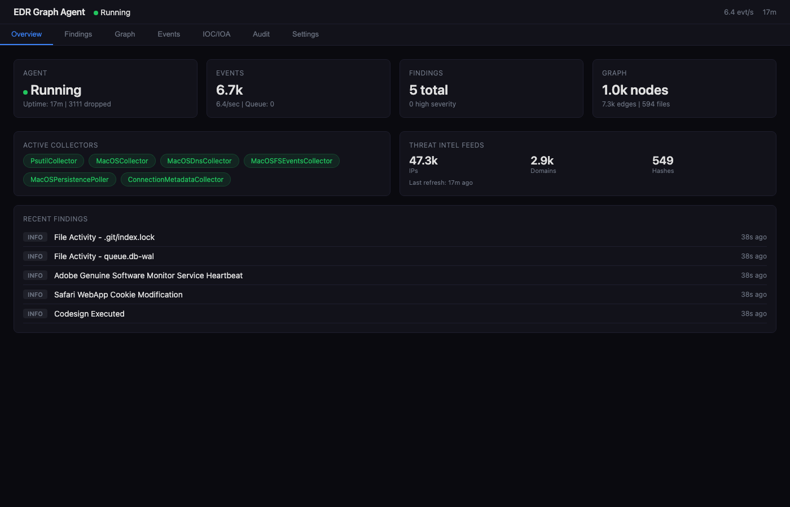

# eDR-Graph

**Advanced Endpoint Detection & Response with Graph-Based Attack Chain Correlation and AI Analysis**

> **Notice:** The Chain-Aware Ancestry Enforcement Engine architecture is Patent Pending.



---

## What is eDR-Graph?

eDR-Graph is a cross-platform EDR agent that bridges deterministic local enforcement with asynchronous, AI-driven threat hunting. Built around an embedded [Kuzu](https://kuzudb.com) graph database, it maps OS-level telemetry into temporal attack chains and uses a dual-pipeline architecture to contain threats in milliseconds while leveraging an LLM to analyze novel tradecraft.

## Key Capabilities

- **Graph-Based Attack Chain Correlation** — Every telemetry event is decomposed into entities and relationships in a property graph, enabling full attack chain reconstruction by walking edges rather than searching flat logs. [Learn more](ARCHITECTURE/pipeline.md)
- **Dual-Pipeline Architecture (EPP + EDR)** — Known threats are blocked in sub-millisecond time via a synchronous fast-path; novel behaviors are investigated asynchronously by an LLM with tool-use capabilities. [Learn more](ARCHITECTURE/filtering_pipeline.md)
- **LLM Threat Analyzer with Agentic Tool Use** — Gemma3-27B reasons about process behavior in full attack chain context, iteratively calling 8+ investigation tools (IP geolocation, WHOIS, AbuseIPDB, VirusTotal, MITRE ATT&CK, graph queries). [Learn more](ARCHITECTURE/pipeline.md#stage-6-llm-analysis)
- **Chain-Aware Allow/Block Rules** — Rules scoped to process ancestry chains and user identities, preventing overly broad allowlists while enabling precise enforcement. [Learn more](ARCHITECTURE/filtering_pipeline.md)
- **Multi-Platform Telemetry** — Native collectors for Linux (eBPF, auditd), macOS (Unified Log, FSEvents), and Windows (ETW, Event Log) with OCSF normalization. [Learn more](performance/os-capabilities.md)
- **Three-Mode Response Engine** — Learning (baseline), Passive (alert), and Active (enforce) modes with human-in-the-loop approval gates and a protected process list. [Learn more](ARCHITECTURE/threat_landscape_matrix.md)
- **Real-Time Threat Intelligence** — 8 open-source IOC feeds (~50K indicators) matched against live telemetry, plus DGA detection, persistence monitoring, and code signing verification. [Learn more](ARCHITECTURE/threat_landscape_matrix.md)
- **Self-Protection** — SHA-256 tamper detection, protected process list, and watchdog heartbeat monitoring. [Learn more](performance/limitations.md)

## Architecture Overview

```
┌──────────────────────────────────────────────────────────────────────────────┐
│                           EDR Graph Agent                                    │
│                                                                              │
│  ┌─────────────┐   ┌──────────────┐   ┌──────────────┐   ┌──────────────┐  │
│  │  Collectors  │──▶│  Normalizer  │──▶│  Processor   │──▶│  Graph DB    │  │
│  │  (per-OS)   │   │  (OCSF)      │   │  (entities + │   │  (Kuzu)      │  │
│  └─────────────┘   └──────────────┘   │   fast-path)  │   └──────┬───────┘  │
│        │                               └──────┬───────┘          │          │
│        ▼                                      │ (blocked)        ▼          │
│  ┌─────────────┐   ┌──────────────────────────┼───────────────────────────┐ │
│  │  SQLite     │   │                 LLM Analyzer                         │ │
│  │  Queue      │   │  ┌──────────┐  ┌───────────┐  ┌──────────────────┐  │ │
│  │  + Findings │   │  │ Preflight│─▶│ Tool-Use  │─▶│ Finding Builder  │  │ │
│  │  + Audit    │   │  │ (novelty)│  │ Loop (5x) │  │ + Chain Context  │  │ │
│  └─────────────┘   │  └──────────┘  └───────────┘  └──────────────────┘  │ │
│                     │       │          │ ▲                                 │ │
│                     │       │          ▼ │                                 │ │
│                     │  ┌────────────────────────────────────┐             │ │
│                     │  │ Tools: IP Geo │ WHOIS │ MITRE      │             │ │
│                     │  │ AbuseIPDB │ VT │ Graph │ LOLBAS    │             │ │
│                     │  └────────────────────────────────────┘             │ │
│                     └────────────────────────────────────────────────────┘  │
│                                          │                                  │
│                                          ▼                                  │
│  ┌───────────────────────────────────────────────────────────────────────┐  │
│  │                      Response Engine  ◀── fast-path (skip LLM)        │  │
│  │  Severity ──▶ Baseline/Allow/Block ──▶ Approval ──▶ Execute ──▶ Audit │  │
│  │                                                                       │  │
│  │  Actions: Suspend │ Terminate │ Isolate Network │ Block IP            │  │
│  │           Quarantine File │ DNS Sinkhole │ Panic Isolate              │  │
│  └───────────────────────────────────────────────────────────────────────┘  │
│                                                                              │
│  ┌──────────────┐  ┌────────────┐  ┌─────────────┐  ┌────────────────────┐ │
│  │  Dashboard   │  │  Tray Icon │  │  Prometheus  │  │  Tamper Detection  │ │
│  │  (FastAPI)   │  │  (macOS)   │  │  Metrics     │  │  (SHA-256 verify)  │ │
│  └──────────────┘  └────────────┘  └─────────────┘  └────────────────────┘ │
└──────────────────────────────────────────────────────────────────────────────┘
```

## Quick Links

| Section | Description |
|---------|-------------|
| [Quickstart Guide](getting-started/quickstart.md) | Install, configure, and run in 5 minutes |
| [Configuration Reference](getting-started/configuration.md) | All settings, env vars, CLI args, and config.yaml |
| [Telemetry Pipeline](ARCHITECTURE/pipeline.md) | Deep dive into the 7-stage processing architecture |
| [Filtering & ROE](ARCHITECTURE/filtering_pipeline.md) | How the three enforcement stages work |
| [Threat Landscape](ARCHITECTURE/threat_landscape_matrix.md) | Detection/response capability matrix by MITRE ATT&CK |
| [OS Capabilities](performance/os-capabilities.md) | Platform telemetry matrix and MTTD/MTTR benchmarks |
| [System Limitations](performance/limitations.md) | Honest assessment of constraints and tradeoffs |
| [Industry Comparisons](strategic/comparisons.md) | How eDR-Graph compares to legacy AV, enterprise XDR, and open-source EDR |

## Tech Stack

| Component | Technology |
|-----------|-----------|
| Language | Python 3.13 |
| Graph Database | [Kuzu](https://kuzudb.com) (embedded, columnar) |
| Event Queue / Audit | SQLite (WAL mode, thread-safe) |
| LLM | Gemma3-27B via DeepInfra (OpenAI-compatible API) |
| Web Dashboard | FastAPI + vanilla JS SPA |
| Metrics | Prometheus client |
| Config | Pydantic + YAML |
| Process Info | psutil |
| macOS Tray | rumps |
| Logging | structlog (JSON/text) |
| Testing | pytest (~550 tests) |

## License

Apache License 2.0 — see [LICENSE](https://github.com/ticfinack/edr-graph/blob/main/LICENSE) for details.

> **Notice:** The Chain-Aware Ancestry Enforcement Engine architecture is Patent Pending.

> **Disclaimer:** This software is provided for educational and research purposes only. It is not a certified or commercially supported security product. Use at your own risk.
